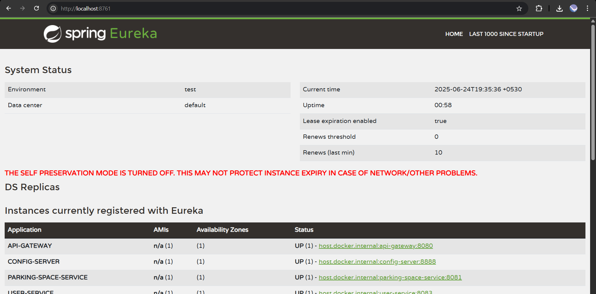

# 🚗 Smart Parking Management System (SPMS)

## 📌 Project Overview

The **Smart Parking Management System (SPMS)** is a cloud-native, microservice-based backend system designed to resolve urban parking issues. It enables users to search for, reserve, and release parking spaces while tracking vehicle movements and handling payments. Built with Spring Boot and Spring Cloud, the architecture supports modular, scalable deployment.

---

## 🎯 Objectives

- Enable real-time parking space discovery and reservation.
- Simulate vehicle entry and exit with booking logs.
- Allow owners to manage their parking spaces.
- Support user authentication and profile management.
- Integrate mock payment functionality with receipts.
- Maintain scalable and resilient services via microservices.

---

## 🧱 Microservices Overview

| Microservice             | Description |
|--------------------------|-------------|
| **user-service**         | Handles user registration, login, profile, bookings |
| **vehicle-service**      | Manages vehicle registration and entry/exit tracking |
| **parking-space-service**| Manages parking space availability and reservations |
| **payment-service**      | Simulates payment transactions and receipts |
| **eureka-server**        | Service registry and discovery |
| **config-server**        | Centralized configuration management |
| **api-gateway**          | Single entry point to route client requests |

---

## 🛠️ Technologies Used

- **Spring Boot**
- **Spring Cloud (Eureka, Gateway, Config)**
- **MySQL**
- **JPA/Hibernate**
- **Postman**
- *(Optional)* Node.js or Flask for specific services

---
---

## 🚀 Running the Application

1. **Start MySQL** and ensure databases are created (auto-creation enabled).
2. Start the microservices in this order:
    - `eureka-server`
    - `config-server`
    - `api-gateway`
    - `user-service`, `vehicle-service`, `parking-space-service`, `payment-service`
3. Open Eureka Dashboard:  
   🔗 [http://localhost:8761](http://localhost:8761)
4. Test endpoints via Postman (import collection below)

---

## 📬 Resources

- 📦 [Postman Collection](./Smart-Parking.postman_collection.json)
- 🖼️ 

## 🏁 Conclusion

The SPMS demonstrates scalable, decoupled design using microservices for real-world smart parking systems. It showcases best practices in service discovery, centralized config, modular development, and RESTful API design.